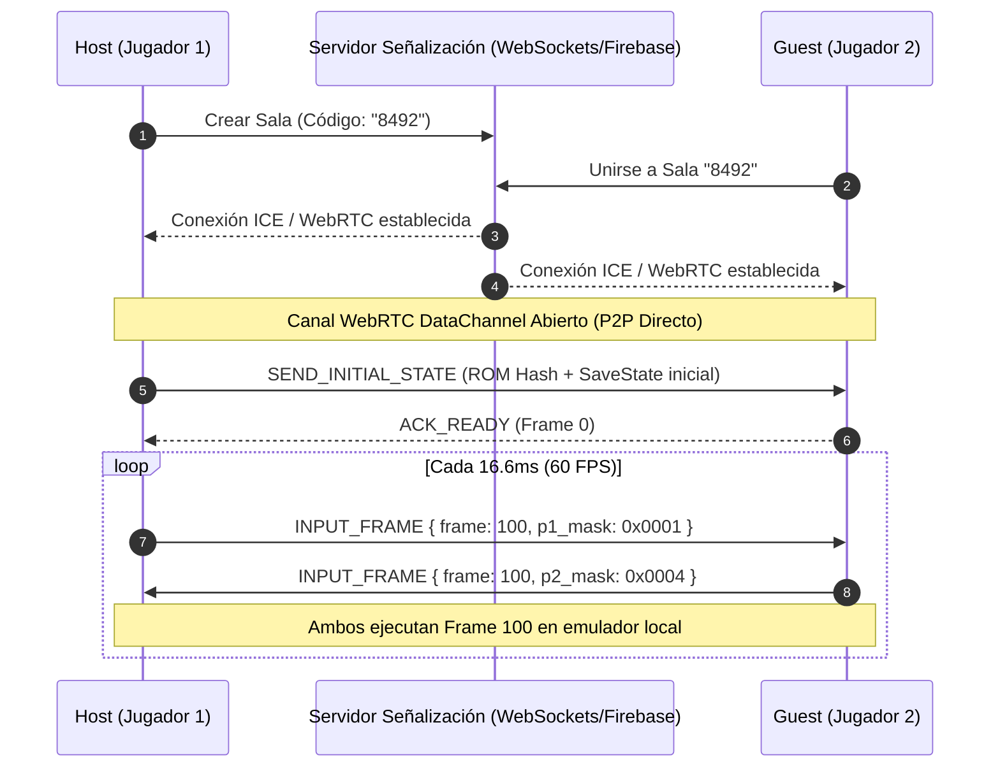

# Análisis Técnico: Implementación de Multijugador a la Distancia (Arcade Netplay)

Este documento analiza la factibilidad técnica y la arquitectura necesaria para permitir que dos personas a la distancia jueguen al mismo arcade en tiempo real dentro de **moai3**.

---

## 1. Introducción y Concepto Clave

### El Mito del Streaming de Video
A primera vista podría parecer que para jugar a la distancia se necesita transmitir el video del juego desde un celular a otro. Sin embargo, en la emulación arcade retro, el enfoque óptimo es el **Netplay por Sincronización de Entradas (Inputs)**.

### ¿Por qué el video es idéntico en ambas pantallas?
Los emuladores arcade (como **FBNeo** o **MAME** ejecutados vía **Libretro**) son **sistemas 100% deterministas**:
1. Si dos dispositivos inician la emulación desde el mismo estado de memoria (**Frame 0** o la misma foto de memoria RAM / *SaveState*).
2. Y en cada ciclo de reloj (**Frame N**), la CPU del emulador en ambos dispositivos recibe exactamente los mismos comandos de botones ($P1$ y $P2$).
3. **Ambas CPUs calcularán exactamente los mismos píxeles y el mismo audio de salida localmente.**

No se transmite video por la red: cada dispositivo renderiza su propia pantalla a 60 FPS con calidad nativa, transmitiendo únicamente pequeñas máscaras de bits binarias de los botones presionados.

---

## 2. Comparativa de Alternativas Arquitectónicas

| Criterio | Opción A: Netplay por Inputs (Recomendada) | Opción B: Video Streaming (Remote Play) |
| :--- | :--- | :--- |
| **Consumo de Banda de Red** | Ultra bajo (~2 a 5 KB/s) | Alto (~3 a 8 Mbps) |
| **Calidad de Imagen** | 60 FPS nativo, resolución original | Comprimida con pérdida (H.264/VP8) |
| **Latencia de Renderizado** | Cero latencia gráfica local | Latencia de codificación + decodificación |
| **Requisito de Archivo** | Ambos jugadores deben tener la ROM localmente | Solo el Host necesita la ROM |
| **Carga de CPU/GPU** | Emulación normal en ambos equipos | Alta en el Host (codificación en tiempo real) |

---

## 3. Funcionamiento Técnico de la Sincronización

### A. Alineación por Número de Frame (Lockstep / Input Delay)
Para que los dos emuladores avancen en sintonía, los mensajes transmitidos por la red contienen el índice del fotograma:

$$\text{Paquete Netplay} = \{ \text{frame}: 1042, \text{input\_p1}: 0x0005, \text{input\_p2}: 0x0010 \}$$

1. **Host (Jugador 1)** lee su mando/pantalla táctil local para el **Frame 1042** y envía su bitmask por la red al **Guest (Jugador 2)**.
2. **Guest (Jugador 2)** lee su mando/pantalla táctil local para el **Frame 1042** y envía su bitmask al Host.
3. Ambos emuladores avanzan al siguiente cuadro **únicamente cuando poseen las entradas de ambos jugadores** para ese frame en particular.
4. Si la red se demora, la emulación se pausa unos milisegundos (buffer de 2 a 4 frames de retardo) para mantener el sincronismo absoluto.

### B. Estado Inicial y Anti-Desincronización (Checksums)
* **Inicio de Sala:** Al conectar, el Host genera un archivo de estado inicial (*SaveState*) o reinicia la ROM a Frame 0 y se lo envía al Guest.
* **Verificación Periodeica:** Cada 60 u 120 frames (~1-2 segundos), los dispositivos intercambian un hash/checksum ligero de la RAM. Si ocurre un fallo de red (*Desync*), el Host reenvía automáticamente un *SaveState* en segundo plano para volver a alinear al Guest sin interrumpir la partida.

---

## 4. Cambios Necesarios en la Arquitectura de `moai3`

Actualmente, `moai3` cuenta con un motor nativo C++ (`arcade_runner.cpp`), un gestor en Kotlin (`ArcadeEmulatorManager.kt`) y servicios en Dart (`ArcadeEmulatorService`).

### A. Capa C++ Nativa (`android/app/src/main/cpp/arcade_runner.cpp`)
1. **Soporte para múltiples puertos de entrada:**
   Modificar `core_input_state_cb`:
   ```cpp
   static std::atomic<uint16_t> g_input_bitmask_p1{0};
   static std::atomic<uint16_t> g_input_bitmask_p2{0};

   static int16_t core_input_state_cb(unsigned port, unsigned device, unsigned index, unsigned id) {
       if ((device & RETRO_DEVICE_MASK) != RETRO_DEVICE_JOYPAD) return 0;

       uint16_t mask = (port == 0) ? g_input_bitmask_p1.load() :
                       (port == 1) ? g_input_bitmask_p2.load() : 0;

       // Mapeo de bits a botones Libretro...
   }
   ```
2. **Métodos JNI para entradas remotas:**
   Exponer una función JNI `nativeSendRemoteInputMask(JNIEnv* env, jobject thiz, jint player, jint mask)` para que Kotlin/Dart actualicen de forma independiente la entrada del Jugador 1 y Jugador 2.

### B. Capa Kotlin (`android/app/src/main/kotlin/com/infomak/moai/games/ArcadeEmulatorManager.kt`)
* Agregar llamadas a MethodChannel para enviar `maskP1` y `maskP2`.

### C. Capa Dart / Flutter (`lib/features/games/services/`)
1. **`NetplayService` (Nuevo servicio):**
   * Encargado del emparejamiento entre usuarios.
   * Utilizar **WebRTC DataChannel** (vía `flutter_webrtc`) para comunicación P2P directa UDP con latencia mínima, o un relay WebSocket/Firebase para señalización inicial.
2. **`ArcadeEmulatorService`:**
   * Recibir el input local del jugador.
   * Transmitir dicho input al peer mediante `NetplayService`.
   * Enviar los inputs locales y remotos al motor nativo para cada frame.

---

## 5. Protocolo de Red Sugerido (P2P / WebRTC DataChannel)



---

## 6. Roadmap de Implementación Futura

Cuando se decida implementar esta funcionalidad, se sugiere seguir este orden:

- [ ] **Fase 1: Multijugador Local (2 Mandos)**
  - Adaptar `arcade_runner.cpp` para aceptar `port 1` (Jugador 2).
  - Permitir conectar 2 mandos Bluetooth/USB al mismo dispositivo Android/TV.

- [ ] **Fase 2: Infraestructura de Red P2P**
  - Implementar servidor ligero de señalización para conectar dos usuarios por código de sala de 4 dígitos.
  - Establecer canal de comunicación P2P WebRTC DataChannel en Flutter.

- [ ] **Fase 3: Bucle de Sincronización Netplay (Input Delay / Lockstep)**
  - Sincronizar el loop de emulación nativo con la recepción de paquetes de red.
  - Implementar buffer de retardo configurable (2 a 4 frames) según el Ping de la conexión.
  - Añadir soporte de verificación de Checksum para detectar desincronizaciones.

---
*Nota: Este documento es únicamente de carácter de análisis e investigación técnica previa.*
