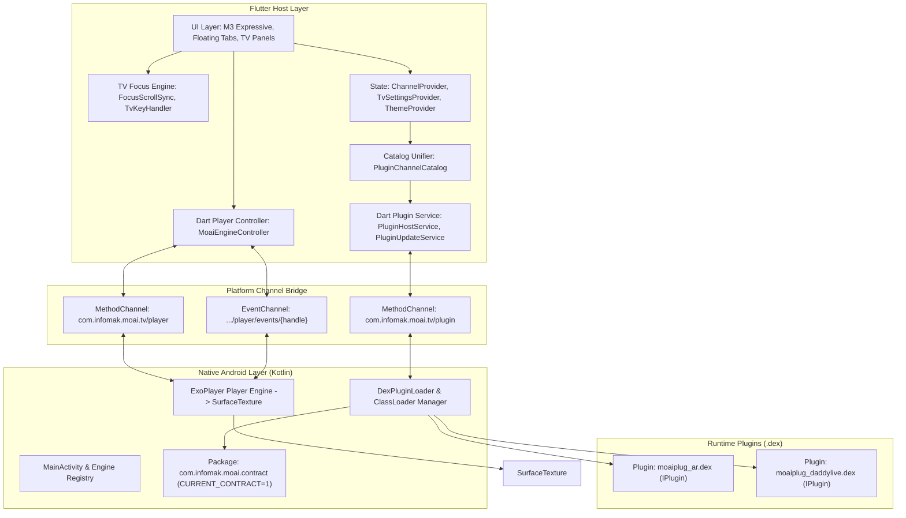

# SPEC-00: Arquitectura General de MoAI 3

> **Estado**: Congelado (Baseline v3.0.11)  
> **Área**: Sistema / Plataforma  
> **Target**: Android TV, Smart TV, Android Mobile  
> **Stack**: Flutter (Dart) + Android Nativo (Kotlin / ExoPlayer / DexClassLoader)

---

## 1. Visión y Propósito del Sistema

**MoAI 3** es una aplicación de streaming y reproducción de contenidos en vivo diseñada primariamente para entornos de **Android TV y Smart TV** (control remoto por D-Pad), con soporte extendido para dispositivos móviles.

El sistema se apoya en una arquitectura modular desacoplada:
1. **Host UI & Orquestador (Flutter)**: Gestión visual bajo Material 3 Expressive, control del foco direccional, gestión de favoritos, control parental y catálogo unificado.
2. **Motor Nativo de Reproducción (ExoPlayer + SurfaceTexture)**: Reproducción de video de alto rendimiento sin sobrecarga de PlatformViews, renderizando directamente a un `Texture` de Flutter.
3. **Motor Dinámico de Plugins (`.dex`)**: Carga en tiempo de ejecución de plugins externos aislados en formato `.dex` a través de `DexClassLoader`, protegiendo la app mediante contratos versionados inmutables.

---

## 2. Diagrama de Capas del Sistema

---

## 3. Principios Fundamentales de Diseño

1. **Zero PlatformViews para Video**: Todo el pipeline de video se renderiza sobre texturas nativas de GPU compartidas (`SurfaceTexture` / `TextureId`), garantizando 60 fps y estabilidad en chipsets de TV de gama baja.
2. **Contrato Nativo Congelado**: El contrato de plugins nativo `CURRENT_CONTRACT = 1` es inmutable. Ningún plugin puede modificar las clases de la app principal; compila contra el contrato provisto.
3. **Navegación TV First**: Cada pantalla, diálogo y lista está gobernada por modelos deterministas de foco D-Pad (Up, Down, Left, Right, Select, Back), evitando loops de foco o pérdida de cursor.
4. **Resilencia a Fallas de Red y Streaming**: Temporizadores de watchdog (45 segundos en buffering) para evitar spinners infinitos y permitir reintentos automáticos (`fallbackIndex`).
5. **Aislamiento de Seguridad Parental**: El contenido clasificado como adulto no se muestra ni se resuelve a menos que la sesión actual haya sido desbloqueada mediante PIN de 4 dígitos.
