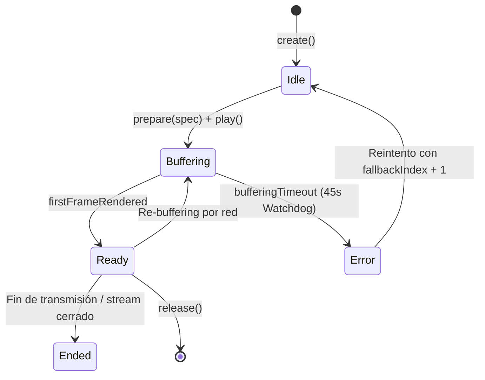

# SPEC-32: Motor de Reproducción de Video y Ciclo de Vida del Stream

> **Estado**: Congelado (Baseline v3.0.11)  
> **Área**: Multimedia / Motor de Video  
> **Archivos de Referencia**: `lib/engine/moai_engine_player.dart`, `lib/engine/engine_player_view.dart`, `android/app/src/main/kotlin/com/infomak/moai/MainActivity.kt`

---

## 1. Arquitectura de Renderizado por Textura

El reproductor de MoAI 3 rechaza deliberadamente el uso de `PlatformView` (Virtual Displays o Hybrid Composition) debido a penalizaciones severas de rendimiento y tearing en Android TV.

1. **Pipeline de Video**:
   - ExoPlayer renderiza las tramas decodificadas directamente en un `android.graphics.SurfaceTexture`.
   - El ID de dicha textura (`textureId`) se entrega a Flutter en la llamada `create`.
   - En el árbol de widgets de Flutter se dibuja un único widget: `Texture(textureId: controller.textureId!)`.
2. **Ventaja Competitiva**:
   - Latencia cero en transiciones.
   - Composición gráfica acelerada por hardware de 60 fps.
   - Consumo mínimo de memoria RAM en decodificadores de 1 GB o 2 GB.

---

## 2. Máquina de Estados del Reproductor

### 2.1. Estados del Motor (`MoaiEngineState`)
- `idle`: Reproductor instanciado sin medio cargado o detenido.
- `buffering`: Conectando al socket o llenando el buffer inicial de paquetes.
- `ready`: Medio listo y primer cuadro visible en pantalla.
- `ended`: Stream completado o finalizado por el servidor.
- `error`: Excepción en decodificación, red o timeout.

### 2.2. Watchdog Anti-Spinner (45 Segundos)
Para evitar que la interfaz de televisión quede atrapada indefinidamente con un indicador de carga circular si un enlace HLS remoto deja de responder sin cerrar la conexión TCP:
- Al entrar en `buffering`, se activa un temporizador de 45 segundos (`bufferingTimeout`).
- Si antes de dicho plazo no se recibe el evento `firstFrame` ni `ready`, el watchdog cancela la operación y dispara una transición forzada a `MoaiEngineState.error` con código `-2` (`BufferingWatchdogTimeout`), permitiendo que el orquestador active el siguiente fallback.

---

## 3. Resolución Dinámica y Mecanismo de Fallback

Cuando un canal proviene de un plugin:
1. La UI llama a `PluginHostService.resolve(pluginId, channelId)` con `fallbackIndex = 0`.
2. El resultado entrega una URL directa junto a cabeceras HTTP personalizadas (User-Agent, Referer) y esquema DRM (Widevine o ClearKey si aplica).
3. Se ensambla un `MoaiMediaSpec` y se envía a `controller.prepare(spec)`.
4. Si ExoPlayer reporta error o timeout, el controlador solicita una nueva resolución incrementando `fallbackIndex`, permitiendo al plugin regenerar tokens de sesión o conmutar a espejos de respaldo.
