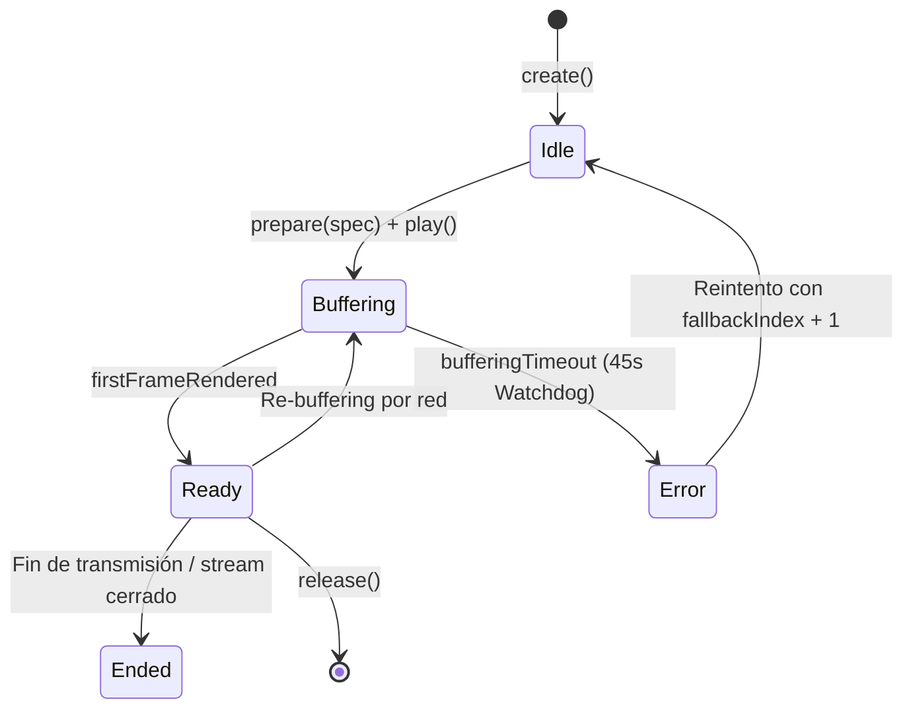

# SPEC-32: Motor de Reproducción de Video y Ciclo de Vida del Stream

> **Estado**: Congelado (Baseline v3.0.11)  
> **Área**: Multimedia / Motor de Video  
> **Archivos de Referencia**: `lib/engine/moai_engine_player.dart`, `lib/engine/engine_player_view.dart`, `android/app/src/main/kotlin/com/infomak/moai/MainActivity.kt`

---

## 1. Arquitectura de Renderizado por Textura

El reproductor de MoAI 3 rechaza deliberadamente el uso de `PlatformView` (Virtual Displays o Hybrid Composition) debido a penalizaciones severas de rendimiento y tearing en Android TV.

1. **Pipeline de Video**:
   - ExoPlayer renderiza las tramas decodificadas directamente en un `android.graphics.SurfaceTexture`.
   - El ID de dicha textura (`textureId`) se entrega a Flutter en la llamada `create`.
   - En el árbol de widgets de Flutter se dibuja un único widget: `Texture(textureId: controller.textureId!)`.
2. **Ventaja Competitiva**:
   - Latencia cero en transiciones.
   - Composición gráfica acelerada por hardware de 60 fps.
   - Consumo mínimo de memoria RAM en decodificadores de 1 GB o 2 GB.

---

## 2. Máquina de Estados del Reproductor

```mermaid
stateDiagram-v2
    [*] --> Idle: create()
    Idle --> Buffering: prepare(spec) + play()
    Buffering --> Ready: firstFrameRendered
    Buffering --> Error: bufferingTimeout (45s Watchdog)
    Ready --> Buffering: Re-buffering por red
    Ready --> Ended: Fin de transmisión / stream cerrado
    Error --> Idle: Reintento con fallbackIndex + 1
    Ready --> [*]: release()
```

### 2.1. Estados del Motor (`MoaiEngineState`)
- `idle`: Reproductor instanciado sin medio cargado o detenido.
- `buffering`: Conectando al socket o llenando el buffer inicial de paquetes.
- `ready`: Medio listo y primer cuadro visible en pantalla.
- `ended`: Stream completado o finalizado por el servidor.
- `error`: Excepción en decodificación, red o timeout.

### 2.2. Watchdog Anti-Spinner (45 Segundos)
Para evitar que la interfaz de televisión quede atrapada indefinidamente con un indicador de carga circular si un enlace HLS remoto deja de responder sin cerrar la conexión TCP:
- Al entrar en `buffering`, se activa un temporizador de 45 segundos (`bufferingTimeout`).
- Si antes de dicho plazo no se recibe el evento `firstFrame` ni `ready`, el watchdog cancela la operación y dispara una transición forzada a `MoaiEngineState.error` con código `-2` (`BufferingWatchdogTimeout`), permitiendo que el orquestador active el siguiente fallback.

---

## 3. Resolución Dinámica y Mecanismo de Fallback

Cuando un canal proviene de un plugin:
1. La UI llama a `PluginHostService.resolve(pluginId, channelId)` con `fallbackIndex = 0`.
2. El resultado entrega una URL directa junto a cabeceras HTTP personalizadas (User-Agent, Referer) y esquema DRM (Widevine o ClearKey si aplica).
3. Se ensambla un `MoaiMediaSpec` y se envía a `controller.prepare(spec)`.
4. Si ExoPlayer reporta error o timeout, el controlador solicita una nueva resolución incrementando `fallbackIndex`, permitiendo al plugin regenerar tokens de sesión o conmutar a espejos de respaldo.

---

## 4. Gestión de Ciclo de Vida y Liberación Segura (`Safe Disposal`)

### 4.1. Sincronía Estricta en `void dispose()`
- En Flutter, sobreescribir `dispose()` como un método asíncrono (`Future<void> dispose() async`) rompe el contrato canónico del framework, impidiendo que el recolector de basura libere los recursos inmediatamente y generando condiciones de carrera al destruir y recrear widgets rápidamente (por ejemplo, al alternar canales o navegar entre paneles).
- `MoaiEnginePlayer` y `TvViewer` implementan un `void dispose()` completamente sincrónico:
  - Las tareas asíncronas de liberación en la capa nativa (`MethodChannel.invokeMethod('release')`) se delegan en segundo plano mediante `unawaited()` sin bloquear ni convertir a `dispose()` en `async`.
  - Los controladores de eventos y suscripciones a streams (`StreamSubscription`) se cancelan de inmediato.

### 4.2. Protección Antirregresión con `SafeChangeNotifier`
- En entornos de televisión con transiciones de navegación rápidas, pueden recibirse respuestas HTTP o eventos de socket después de que un `ChangeNotifier` haya sido desmontado.
- Para prevenir la excepción de depuración `A ChangeNotifier was used after being disposed`:
  - `SafeChangeNotifier` intercepta las invocaciones a `notifyListeners()`.
  - Si el objeto ya fue marcado como dispuesto (`_isDisposed == true` o bandera interna de Flutter), la notificación se descarta de forma silenciosa y segura, protegiendo a `CalendarProvider` y a los controladores de estado.

### 4.3. Cierre Defensivo de E/S en Actualizaciones (`UpdateService`)
- Al descargar APKs o paquetes binarios OTA:
  - Se garantiza el cierre ordenado de `IOSink` y `HttpClient` dentro de bloques `try / finally`.
  - Si una descarga es abortada o sufre una excepción de socket a mitad de transmisión, los descriptores de archivo temporales se limpian y se cierran sin dejar fugas de handles en el sistema operativo.

