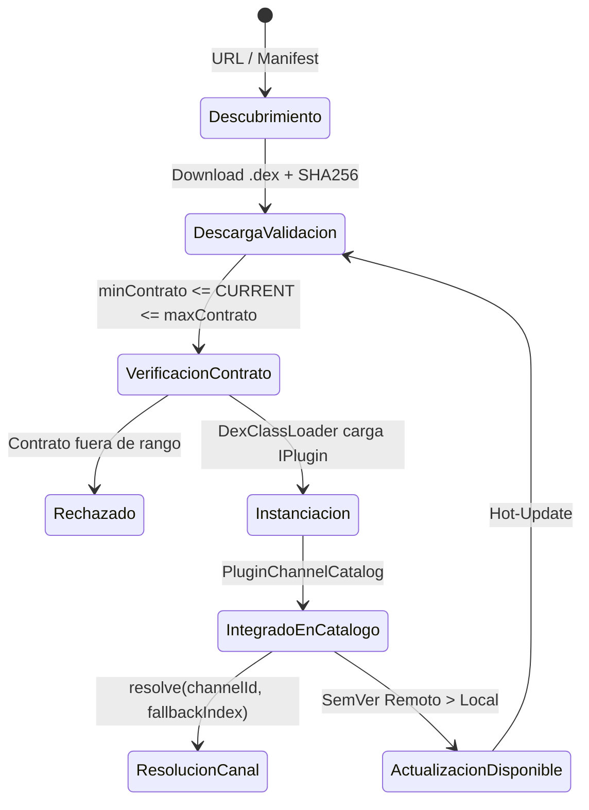

# SPEC-31: Ciclo de Vida y Actualizaciones de Plugins (.dex)

> **Estado**: Congelado (Baseline v3.0.11)  
> **Área**: Motor de Plugins / Servicios de Fondo  
> **Archivos de Referencia**: `lib/services/plugin_host_service.dart`, `lib/services/plugin_update_service.dart`

---

## 1. Ciclo de Vida de una Fuente Plugin



---

## 2. Consolidación del Catálogo de Canales (`PluginChannelCatalog`)

1. **Lectura Agregada**:
   `PluginHostController` consulta periódicamente la lista de fuentes instaladas al host nativo.
2. **Generación de Canales de App**:
   Cada canal listado en `source.canales` se transforma en una instancia de `Channel` de Flutter con su respectivo `pluginTag` (ejemplo: `'AR'`, `'DL'`) y prefijo canónico en el ID (`plugin:{sourceId}:{channelId}`).
3. **Sincronización Reactiva**:
   Cualquier evento de instalación, desinstalación o refresco notifica inmediatamente a `ChannelProvider`, recalculando las listas activas y manteniendo la consistencia de favoritos.

---

## 3. Servicio de Verificación Secuencial de Actualizaciones (`PluginUpdateService`)

Para no saturar el ancho de banda ni los hilos de red en decodificadores de televisión de hardware limitado:

1. **Deducción de URL de Manifiesto**:
   ```dart
   static String deriveManifestUrl(String rawUrl)
   ```
   Si la URL apunta al binario compilado (`.../plugin.dex`), la sustituye automáticamente por `.../manifest.json` en el mismo host.
2. **Consultas Secuenciales (No Paralelas Masivas)**:
   Las fuentes se verifican una a una con un timeout estricto de 5 segundos por petición HTTP.
3. **Reglas de Detección de Actualización**:
   Se emite un objeto `PluginUpdateInfo` si y solo si:
   - El manifiesto remoto responde HTTP 200 con JSON válido.
   - La cadena `remoteVersion` es mayor que `source.version` según comparación SemVer (`isNewer`).
   - El checksum `sha256` remoto no coincide con el binario local instalado.
4. **Notificación en UI**:
   La presencia de actualizaciones se expone como un indicador visual en el panel de fuentes (`SettingsTvPanel` / `SourceManagement`), permitiendo al usuario actualizar cada fuente con un solo clic de control remoto.
