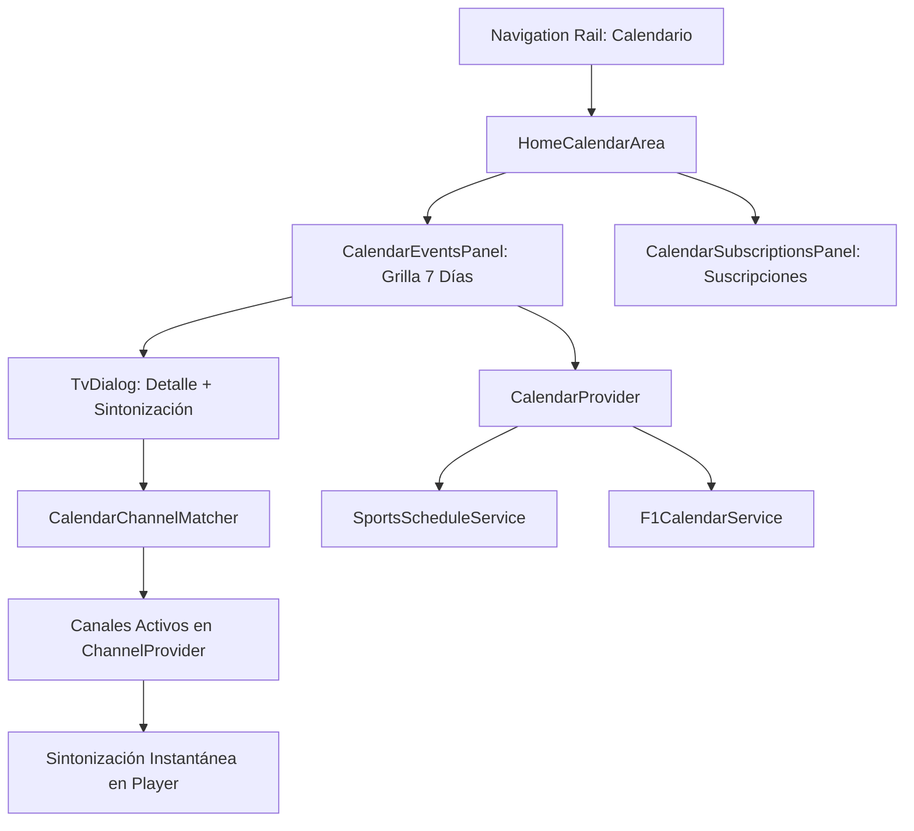

# SPEC-35: Agenda Deportiva de Eventos en Vivo, Suscripciones y Sintonización Directa

> **Estado**: Vigente (Baseline v3.0.14)  
> **Área**: Experiencia de Usuario / Agenda Deportiva y Notificaciones TV  
> **Archivos de Referencia**:  
> - `lib/features/home/areas/home_calendar_area.dart`  
> - `lib/features/calendar/widgets/calendar_events_panel.dart`  
> - `lib/features/calendar/widgets/calendar_subscriptions_panel.dart`  
> - `lib/state/calendar_provider.dart`  
> - `lib/services/calendar/sports_schedule_service.dart`  
> - `lib/services/calendar/f1_calendar_service.dart`  
> - `lib/services/calendar/argentina_time.dart`  
> - `lib/services/calendar/calendar_channel_matcher.dart`  
> - `lib/widgets/feedback/moai_snackbar.dart`  

---

## 1. Visión General y Arquitectura

La **Agenda Deportiva de MoAI 3** integra una vista de 7 días adaptada específicamente para control remoto (D-Pad en Android TV) que permite a los usuarios descubrir transmisiones deportivas en vivo, gestionar suscripciones temáticas (Fórmula 1, Liga Profesional de Fútbol, ligas internacionales, etc.) y sintonizar directamente la señal de TV asociada con un solo clic.

---

## 2. Componentes Principales de Interfaz

### 2.1. Área de Calendario (`HomeCalendarArea`)
- Conecta la selección del Navigation Rail (Índice 1) con la interfaz de eventos.
- Implementa una transición horizontal fluida entre:
  - **Panel de Eventos (`CalendarEventsPanel`)**: Ocupa el área principal.
  - **Panel de Suscripciones (`CalendarSubscriptionsPanel`)**: Panel lateral retráctil a la derecha.
- **Navegación D-Pad**:
  - Al pulsar `ArrowLeft` en el extremo izquierdo (Lunes): retorna el foco al Navigation Rail.
  - Al pulsar `ArrowRight` en el extremo derecho (Domingo): transfiere el foco al panel de suscripciones.
  - Al pulsar `ArrowLeft` desde suscripciones: regresa a la grilla de eventos posicionando el foco en la columna de Domingo (`DOM`).

### 2.2. Panel de Grilla Semanal (`CalendarEventsPanel`)
- **Estructura de 7 Columnas**: LUN, MAR, MIÉ, JUE, VIE, SÁB, DOM.
- **Navegación Vertical y Paginación**:
  - Si un día tiene más de 4 eventos, se habilitan flechas de scroll dedicadas (*pill arrows*) por encima y por debajo de la columna sin desplazar el resto de los días.
- **Encabezado y Semanas**:
  - Selector de semana (semana actual, previa y próxima) con botones accesibles por D-Pad.

---

## 3. Ciclo de Vida y Estados de un Evento (`CalendarEventStatus`)

Los eventos deportivos atraviesan tres estados deterministas:

1. **`live` (En Vivo - Prioridad 0)**:
   - Se consideran en vivo los eventos cuya hora actual se encuentra dentro del rango de transmisión estimada (típicamente desde el inicio hasta +120 minutos, o 60-75 min en clasificaciones de F1).
   - Se identifican visualmente con una píldora sólida que incluye el icono Material `Icons.fiber_manual_record_rounded` y el texto `"EN VIVO"`.
2. **`upcoming` (Próximo - Prioridad 1)**:
   - Eventos futuros dentro de la semana. Exhiben su hora de inicio programada con `Icons.schedule_rounded`.
3. **`finished` (Finalizado - Prioridad 2)**:
   - Eventos concluidos. Se presentan atenuados (45-50% de opacidad) con el icono `Icons.check_circle_outline_rounded` y texto `"FINALIZADO"`.
   - **Comportamiento No-op**: Al presionar `OK` o `Enter` sobre un evento finalizado, se consume el evento de teclado sin abrir modal ni disparar sintonización, evitando pantallas negras en enlaces caducados.

### 3.1. Ordenamiento Inteligente
Dentro de cada día, los eventos se ordenan en dos niveles:
1. **Prioridad por Estado**: `live` (arriba de todo) ➔ `upcoming` ➔ `finished` (al final).
2. **Criterio Secundario**: Orden cronológico ascendente por `startDateTime`.

### 3.2. Cero Emojis (Iconografía Material Pura)
- Se sanitizan estrictamente todos los títulos de eventos y categorías, eliminando emojis (⚽, 🏁, 📺) y símbolos suplementarios.
- La identidad deportiva se transmite exclusivamente mediante `Icon` de Material (`Icons.sports_soccer`, `Icons.sports_motorsports`, `Icons.sports_football`, etc.).

---

## 4. Modal de Sintonización Directa de Canales (`TvDialog`)

Al presionar `OK` sobre un evento en estado `live` o `upcoming`:

1. **Evaluación de Disponibilidad de Canales**:
   - `CalendarChannelMatcher` analiza el evento contra el listado de canales instalados en `ChannelProvider`.
2. **Layout Adaptable de 1 o 2 Columnas**:
   - **Con Canales (`matchingChannels.isNotEmpty`)**: Se expande a un modal horizontal de 2 columnas:
     - *Columna Izquierda*: Datos del evento (deporte, horario, torneo) y botón Cerrar.
     - *Columna Derecha*: Lista vertical de canales sugeridos utilizando tarjetas `NewChannelCard` con logos y badges de plugin (ej. `AR`, `DL`).
   - **Sin Canales (`matchingChannels.isEmpty`)**: Se mantiene en una columna compacta informativa sin espacios vacíos.
3. **Sintonización Inmediata**:
   - Al seleccionar un canal en la columna derecha, se cierra el diálogo (`Navigator.pop()`) y se ejecuta `context.read<ChannelProvider>().selectChannel(channel)`, conmutando al reproductor al instante.

### 4.1. Algoritmo de Coincidencia (`CalendarChannelMatcher`)
- **Paso 0 (Hints Directos de Plugin)**: Coincidencias exactas con `channelHints` (ej. IDs de DaddyLive o tags de plugin).
- **Paso 1 (Emisor / Broadcaster)**: Coincidencia textual normalizada con canales como `TNT Sports`, `ESPN Premium`, `TyC Sports`, `Fox Sports`, `DSports`, `Telefe`, `TV Pública`.
- **Paso 2 (Competición / Torneo)**: Fallback contextual (ej. Pack Fútbol para Liga Profesional, Fox/ESPN para F1).

---

## 5. Notificaciones de Eventos en Vivo (`MoaiSnackbar`)

- **Detección Automática**: `CalendarProvider` supervisa periódicamente las suscripciones activas.
- **Snackbar Persistente TV**:
  - Al comenzar un evento suscrito, se emite una alerta flotante en la parte inferior o superior con el título del partido, deporte y opción para sintonizar o descartar.
  - La duración del snackbar es configurable desde Ajustes (3 a 10 segundos, o hasta acción manual).
- **Control de Concurrencia**:
  - `HomeScreen` emplea el flag defensivo `_liveSnackBusy` para asegurar que nunca se apilen múltiples snackbars simultáneos ni se generen deadlocks si un snackbar es descartado mientras se navega por la interfaz.
- **Ajustes de Agenda (`SettingsAgendaPanel`)**:
  - Activar/desactivar notificaciones en vivo.
  - Duración del snackbar.
  - Calibración de zona horaria / offset UTC en `AgendaUtcOffsetScreen`.
