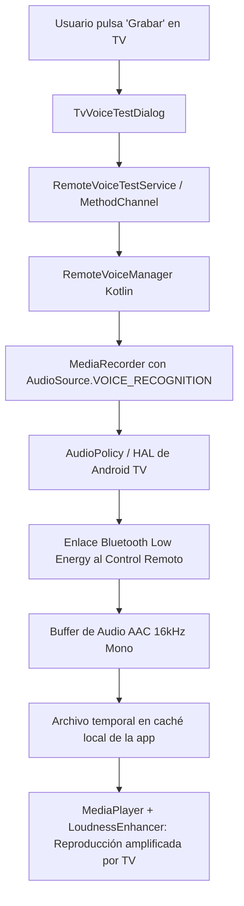

# SPEC-34: Diagnóstico y Captura de Voz del Control Remoto (PoC y Amplificación)

## 1. Propósito
Proveer una solución empírica y no invasiva para capturar transmisiones de voz (Voice-over-BLE) de manera transparente por software mediante el framework estándar de audio de Android (`AudioSource.VOICE_RECOGNITION`), diagnosticando el hardware y aplicando normalización y amplificación digital de la señal de voz.

---

## 2. Arquitectura de Captura en Android TV



### 2.1 Por qué `AudioSource.VOICE_RECOGNITION`
En Android TV, los dispositivos generalmente carecen de micrófono en el chasis físico del televisor o TV box. Si una aplicación intenta grabar con `AudioSource.MIC` (fuente default 1), Android busca un conector analógico inexistente o genera silencio. 
Al especificar `MediaRecorder.AudioSource.VOICE_RECOGNITION` (código 6), la política de audio del sistema (`AudioPolicy`) activa el canal prioritario de reconocimiento de voz y solicita paquetes al periférico de entrada activo (el control remoto emparejado por BLE o USB).

### 2.2 Requisitos y Manifiesto
- Permiso de ejecución: `<uses-permission android:name="android.permission.RECORD_AUDIO" />`.
- Característica opcional: `<uses-feature android:name="android.hardware.microphone" android:required="false" />` (imprescindible que no sea obligatoria para permitir la instalación en dispositivos Leanback / TV).

---

## 3. Componentes Implementados

### 3.1 Capa Nativa (Kotlin)
- [`RemoteVoiceManager.kt`](file:///g:/moai_func/moai/moai3/android/app/src/main/kotlin/com/infomak/moai/voice/RemoteVoiceManager.kt):
  - `checkHardware()`: Enumera las entradas de audio registradas vía `AudioManager.getDevices(GET_DEVICES_INPUTS)`.
  - `hasPermission()` / `requestPermission()`: Comprobación y solicitud en runtime de `RECORD_AUDIO`.
  - `startRecording()`: Inicializa `MediaRecorder` con contenedor `MPEG_4`, codificador `AAC`, tasa de muestreo `16000 Hz`, canal mono y tasa de bits de `32 kbps`.
  - `stopRecording()`: Detiene la captura y devuelve la ruta absoluta y el tamaño en bytes del archivo `.m4a` guardado en `context.cacheDir`.
  - `playRecording()` / `stopPlayback()`: Permite escuchar la grabación directamente a través de los altavoces del televisor con `MediaPlayer`.
- [`MainActivity.kt`](file:///g:/moai_func/moai/moai3/android/app/src/main/kotlin/com/infomak/moai/MainActivity.kt):
  - Canal de comunicación: `com.infomak.moai.tv/remote_voice`.
  - Emite `onPlaybackComplete` al finalizar la reproducción.

### 3.2 Capa Flutter
- [`RemoteVoiceTestService`](file:///g:/moai_func/moai/moai3/lib/services/remote_voice_test_service.dart):
  - Métodos asíncronos tipados para invocar las operaciones nativas y registrar handlers de callback.
- [`TvVoiceTestDialog`](file:///g:/moai_func/moai/moai3/lib/widgets/dialogs/tv_voice_test_dialog.dart):
  - Diálogo modal con diseño M3 Expressive, optimizado para navegación D-Pad en 10 pies.
  - Presenta:
    1. Lista de periféricos de entrada detectados.
    2. Botón de grabación con cuenta regresiva (auto-parada a los 6 segundos).
    3. Botón de reproducción activable tras grabar un archivo con audio real.
    4. Diagnóstico en tiempo real indicando bytes generados y advertencias si el flujo no contiene datos.
- [`SettingsTvPanel`](file:///g:/moai_func/moai/moai3/lib/features/settings/widgets/settings_tv_panel.dart):
  - Acceso directo mediante la fila "Test de Micrófono TV" en la sección de configuración del televisor (y en el futuro mediante SPEC-36).

---

## 4. Resultados de la Validación Empírica en Hardware (PoC Validada)

1. **Captura exitosa por software:**
   - Se verificó en hardware real de Android TV que el control remoto físico responde a `AudioSource.VOICE_RECOGNITION` y envía datos de voz comprimidos a través del enlace Voice-over-BLE.
   - El archivo `.m4a` se genera en caché y contiene la voz del usuario audible.

2. **Síntoma Detectado:**
   - La reproducción del audio grabado a través de los parlantes del televisor se escucha con un **volumen perceptiblemente bajo**.

---

## 5. Diagnóstico Técnico del Nivel de Audio (Grabación vs. Reproducción)

El bajo volumen percibido no se debe a un error aislado, sino a la combinación de dos factores inherentes al hardware y al pipeline de software:

### 5.1 Factor Físico y de Hardware (El Control Remoto)
1. **Micrófono MEMS de baja potencia:**
   - Los controles remotos Bluetooth operan con dos baterías AAA. El sensor de micrófono está miniaturizado y carece de un preamplificador analógico potente para preservar la autonomía energética.
2. **Distancia de captura:**
   - El sensor está diseñado específicamente para que el usuario hable a **5–10 cm de la punta del control**. Si el usuario habla a una distancia convencional (30–60 cm), la presión acústica decae brásticamente (ley del inverso del cuadrado).
3. **Comportamiento de `AudioSource.VOICE_RECOGNITION`:**
   - Esta fuente entrega la señal en bruto a motores de Inteligencia Artificial (ej: Google Assistant), sin aplicar compresión dinámica ni aumentos automáticos de ganancia (AGC agresivo) que pudieran distorsionar las frecuencias formantes del habla. La señal queda grabada en un rango aproximado de **-25 dBFS a -35 dBFS**.

### 5.2 Factor de Software (El Reproductor `MediaPlayer`)
1. **Contraste de sonoridad con la televisión comercial:**
   - El audio de televisión, streaming o películas está fuertemente masterizado con compresión y volumen alto (típicamente entre **-14 y -8 LUFS**).
   - `MediaPlayer` reproduce el archivo grabado de forma directa a escala 1:1 sin normalización ni ganancia añadida. La diferencia entre -30 dBFS y -10 dBFS es de aproximadamente **20 dB**, lo cual el oído humano percibe como una reducción de volumen de 4 a 5 veces.
2. **Ausencia de efectos de sonoridad en `MediaPlayer`:**
   - Actualmente `MediaPlayer` no inicializa `AudioAttributes` específicos de voz ni un motor de ganancia post-procesamiento.

---

## 6. Especificación de Solución para Fase de Producción (Roadmap de Audio)

Para elevar el audio capturado al nivel estándar del contenido de televisión sin saturación, se especifica la implementación de los siguientes mecanismos nativos en Android:

### 6.1 Amplificación Digital en Reproducción (`LoudnessEnhancer`)
En [`RemoteVoiceManager.kt`](file:///g:/moai_func/moai/moai3/android/app/src/main/kotlin/com/infomak/moai/voice/RemoteVoiceManager.kt), durante la inicialización de `MediaPlayer`:
1. **Asignación de `AudioAttributes`:**
   ```kotlin
   val audioAttributes = AudioAttributes.Builder()
       .setContentType(AudioAttributes.CONTENT_TYPE_SPEECH)
       .setUsage(AudioAttributes.USAGE_MEDIA)
       .build()
   player.setAudioAttributes(audioAttributes)
   ```
2. **Inyección de ganancia con `LoudnessEnhancer`:**
   ```kotlin
   val loudnessEnhancer = LoudnessEnhancer(player.audioSessionId).apply {
       // Aumento limpio de +14 dB (+1400 mB) para igualar el nivel de la TV
       setTargetGain(1400)
       enabled = true
   }
   ```
3. **Liberación del efecto:**
   - Liberar la instancia de `LoudnessEnhancer` en `stopPlayback()` y `release()` para evitar fugas de memoria en el servidor de audio de Android (`audioserver`).

### 6.2 Optimización de Captura (En el Encoder)
1. **Ajuste de Bitrate:** Elevar el bitrate de codificación AAC de `32000` a `64000` bps a 16 kHz Mono para capturar mayor rango dinámico en consonantes y sibilancias.
2. **Exploración de `AutomaticGainControl` (AGC):**
   - Verificar si el HAL de la TV expone `AutomaticGainControl.isAvailable()` sobre el descriptor de captura para nivelar automáticamente voces capturadas a mayor distancia.

### 6.3 Ajustes de Interfaz de Usuario (Feedback de Voz)
- En el modal de prueba ([`TvVoiceTestDialog.dart`](file:///g:/moai_func/moai/moai3/lib/widgets/dialogs/tv_voice_test_dialog.dart)), añadir una indicación visual destacada:
  > *"Habla a unos 5 a 10 cm de la punta del control para una mejor captura."*
