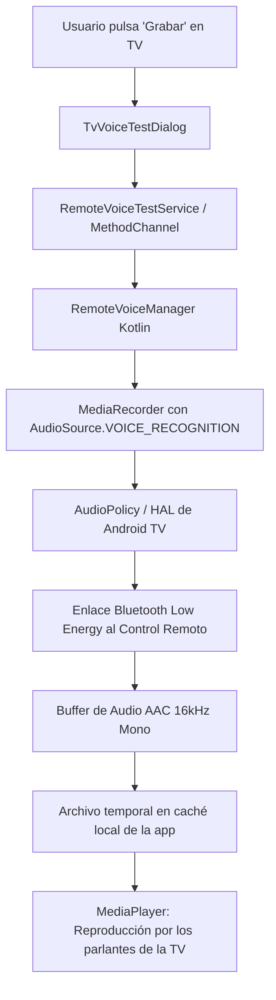

# SPEC-34: Módulo de Diagnóstico y Captura de Voz del Control Remoto (PoC)

## 1. Propósito
Proveer una prueba de concepto (PoC) empírica y no invasiva para verificar si la plataforma de hardware Android TV y el control remoto Bluetooth físico permiten capturar transmisiones de voz (Voice-over-BLE) de manera transparente por software mediante el framework estándar de audio de Android (`AudioSource.VOICE_RECOGNITION`).

## 2. Arquitectura de Captura en Android TV

### 2.1 Por qué `AudioSource.VOICE_RECOGNITION`
En Android TV, los dispositivos generalmente carecen de micrófono en el chasis físico del televisor o TV box. Si una aplicación intenta grabar con `AudioSource.MIC` (fuente default 1), Android busca un conector analógico inexistente o genera silencio. 
Al especificar `MediaRecorder.AudioSource.VOICE_RECOGNITION` (código 6), la política de audio del sistema (`AudioPolicy`) activa el canal prioritario de reconocimiento de voz y solicita paquetes al periférico de entrada activo (el control remoto emparejado por BLE o USB).

### 2.2 Requisitos y Manifiesto
- Permiso de ejecución: `<uses-permission android:name="android.permission.RECORD_AUDIO" />`.
- Característica opcional: `<uses-feature android:name="android.hardware.microphone" android:required="false" />` (imprescindible que no sea obligatoria para permitir la instalación en dispositivos Leanback / TV).

## 3. Componentes Implementados

### 3.1 Capa Nativa (Kotlin)
- [`RemoteVoiceManager.kt`](file:///home/apogeo/moai/moai3/android/app/src/main/kotlin/com/infomak/moai/voice/RemoteVoiceManager.kt):
  - `checkHardware()`: Enumera las entradas de audio registradas vía `AudioManager.getDevices(GET_DEVICES_INPUTS)`.
  - `hasPermission()` / `requestPermission()`: Comprobación y solicitud en runtime de `RECORD_AUDIO`.
  - `startRecording()`: Inicializa `MediaRecorder` con contenedor `MPEG_4`, codificador `AAC`, tasa de muestreo `16000 Hz`, canal mono y tasa de bits de `64 kbps`.
  - `stopRecording()`: Detiene la captura y devuelve la ruta absoluta y el tamaño en bytes del archivo `.m4a` guardado en `context.cacheDir`.
  - `playRecording()` / `stopPlayback()`: Permite escuchar la grabación directamente a través de los altavoces del televisor con `MediaPlayer`.
- [`MainActivity.kt`](file:///home/apogeo/moai/moai3/android/app/src/main/kotlin/com/infomak/moai/MainActivity.kt):
  - Canal de comunicación: `com.infomak.moai.tv/remote_voice`.
  - Emite `onPlaybackComplete` al finalizar la reproducción.

### 3.2 Capa Flutter
- [`RemoteVoiceTestService`](file:///home/apogeo/moai/moai3/lib/services/remote_voice_test_service.dart):
  - Métodos asíncronos tipados para invocar las operaciones nativas y registrar handlers de callback.
- [`TvVoiceTestDialog`](file:///home/apogeo/moai/moai3/lib/widgets/dialogs/tv_voice_test_dialog.dart):
  - Diálogo modal con diseño M3 Expressive, optimizado para navegación D-Pad en 10 pies.
  - Presenta:
    1. Lista de periféricos de entrada detectados.
    2. Botón de grabación con cuenta regresiva (auto-parada a los 6 segundos).
    3. Botón de reproducción activable tras grabar un archivo con audio real.
    4. Diagnóstico en tiempo real indicando bytes generados y advertencias si el flujo no contiene datos.
- [`SettingsTvPanel`](file:///home/apogeo/moai/moai3/lib/features/settings/widgets/settings_tv_panel.dart):
  - Acceso directo mediante la fila "Test de Micrófono TV" en la sección de configuración del televisor.
