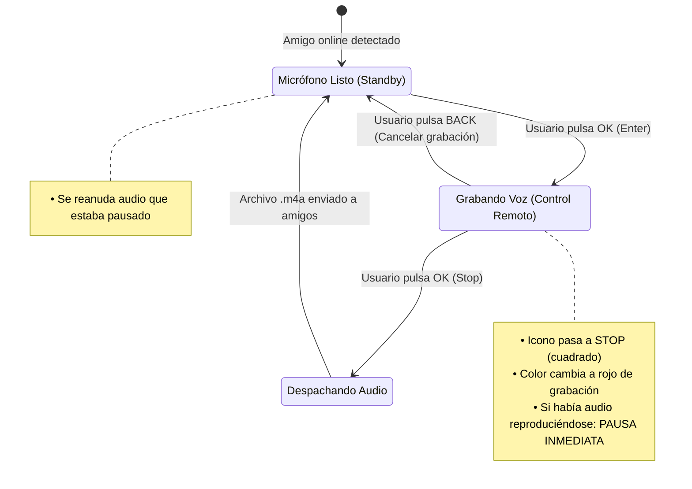

# SPEC-37: Overlay de Voz "Miremos Juntos" y Control de Foco en Reproductor Fullscreen

> **Estado**: Borrador (Diseño Consensuado - Fases 1, 2 y 3)  
> **Área**: Experiencia de Usuario / Reproductor de Video / Funcionalidad Social  
> **Archivos de Referencia**:  
> - `lib/widgets/player/tv_viewer.dart`  
> - `lib/widgets/player/tv_viewer_focus_wrapper.dart`  
> - `lib/features/home/areas/home_tv_area.dart`  
> - `specs/features/watch_party_settings.md` (SPEC-36)  
> - `specs/features/tv_remote_voice_input.md` (SPEC-34)  
> - `specs/features/tv_navigation_and_focus.md` (SPEC-30)

---

## 1. Propósito y Alcance

### Propósito
Definir la arquitectura integral de interfaz, condiciones de visibilidad, avisos visuales de presencia, grabación de voz mediante control remoto y reproducción secuencial de audios de amigos (**Audio Playback Queue**) durante la reproducción de video en pantalla completa (Fullscreen) en Android TV.

### Alcance (In Scope)
1. **Trilogía Superior de Componentes:**
   * **Lado Izquierdo:** Aviso visual pasivo de conexión (`"XXX está viendo"`).
   * **Centro:** Botón interactivo de micrófono / detención (**Mic / Stop Toggle**), poseedor del foco.
   * **Lado Derecho:** Reproductor visual pasivo de audios entrantes (`"🔊 XXX: [||||]"`).
2. **Visibilidad Condicional Estricta:**
   * `watchPartyEnabled == true` (activado en Ajustes).
   * Reproductor en **pantalla completa** (`isFullScreen == true`).
   * Al menos **un amigo conectado** (`friends.any((f) => f.isOnline)`).
3. **Mecánica de Foco y Salida:**
   * El botón central retiene el foco por defecto.
   * Con el botón enfocado, la **única forma** de salir de pantalla completa es presionando **`BACK`**.
   * Si la función está inactiva o no hay amigos online, cualquier tecla o `BACK` sale de pantalla completa.
4. **Grabación de Voz (Toggle-to-Talk):**
   * Pulsar `OK`: Inicia grabación y el botón conmuta a **STOP** (rojo / indicador activo).
   * Pulsar `OK` nuevamente: Detiene la grabación (`stop`), obtiene el archivo `.m4a` y lo despacha a los amigos.
5. **Recepción y Reproducción de Audios (Cola Inteligente FIFO):**
   * Reproducción automática y secuencial de los audios entrantes de los amigos por los altavoces de la TV.
   * A la derecha del micrófono se muestra quién está hablando.
   * **Pausa por Modales:** Si se abre cualquier diálogo o modal, la reproducción y la cola se pausan. Al cerrar el modal, se reanudan.
   * **Prioridad de Grabación y Prevención de Acople Acústico:** Si el usuario pulsa Grabar mientras suena un audio o hay audios en cola, la reproducción se **pausa de inmediato** para que el audio del amigo no se cuele en el micrófono. Al finalizar la grabación (`STOP`), la reproducción pendiente se **reanuda** desde el punto exacto donde se detuvo.

---

## 2. Matriz de Visibilidad y Foco

| Watch Party Habilitado | Modo Pantalla Completa | ¿Hay amigos online? | Visibilidad Barra Superior | Comportamiento al presionar teclas |
| :---: | :---: | :---: | :---: | :--- |
| **OFF** | Sí | Indiferente | **Oculto** | Comportamiento estándar: `BACK` o cualquier tecla sale de pantalla completa. |
| **ON** | No (Ventana) | Indiferente | **Oculto** | Navegación estándar de MoAI 3 (Explorar, canales, tabs). |
| **ON** | Sí | **No** (0 amigos online) | **Oculto** | Comportamiento estándar: `BACK` o cualquier tecla sale de pantalla completa. |
| **ON** | Sí | **Sí** ($\ge 1$ amigo online) | **VISIBLE** | **Mic enfocado por defecto.** Solo `BACK` sale de pantalla completa. |

---

## 3. Especificación de UI: Trilogía Superior

```
┌───────────────────────────────────────────────────────────────────────────────────┐
│                                                                                   │
│      ┌────────────────────────┐   ┌─────────┐   ┌───────────────────────────┐     │
│      │ 🟢  Juan está viendo   │   │   🎙️    │   │ 🔊 Carlos:  |||||  0:03   │     │
│      └────────────────────────┘   └─────────┘   └───────────────────────────┘     │
│         [Aviso de Conexión]        [Centro]        [Reproduciendo Audio]          │
│            (Sin foco, izq)        (Mic con foco)      (Sin foco, der)             │
│                                                                                   │
│                                                                                   │
│                              REPRODUCCIÓN DE VIDEO                                │
│                               (PANTALLA COMPLETA)                                 │
│                                                                                   │
└───────────────────────────────────────────────────────────────────────────────────┘
```

* **Alineación global:** `Alignment.topCenter`.
* **Margen superior:** `top: 32dp` (respetando la zona segura de overscan de TV).
* **1. Lado Izquierdo – Aviso de Conexión:**
  * Chip redondeado (`r: 22dp`) con punto verde 🟢 + `"Juan está viendo"`.
  * `Focusable: false` (sin foco).
* **2. Centro – Botón de Voz (Mic / Stop):**
  * Dimensiones: `56 x 56 dp`.
  * **Estado Standby:** Icono `Icons.mic`, borde con `colorScheme.primary` (grosor 3dp).
  * **Estado Grabando:** Icono `Icons.stop`, fondo `colorScheme.error`, halo pulsante rojo.
  * `Focusable: true` (retiene el foco del control remoto).
* **3. Lado Derecho – Reproductor de Audio Entrante:**
  * Chip redondeado (`r: 22dp`) con icono de altavoz animado 🔊 + `"Carlos:"` + barra de onda/progreso.
  * `Focusable: false` (sin foco).
  * Solo es visible mientras haya un audio reproduciéndose o pausado temporalmente. Cuando la cola queda vacía, desaparece.

---

## 4. Grabación y Emisión de Voz (Toggle-to-Talk)



1. **Inicio de Grabación:**
   * El usuario pulsa `OK` en el botón central.
   * Se inicia `MediaRecorder` con `AudioSource.VOICE_RECOGNITION`.
   * El botón pasa a modo **STOP**.
   * **Antiacople / Silencio:** Si había algún audio de un amigo reproduciéndose por los altavoces de la TV, se **pausa instantáneamente**.
2. **Fin de Grabación y Envío:**
   * El usuario pulsa `OK` nuevamente sobre el botón STOP.
   * Se detiene la captura, se genera el archivo `.m4a` amplificado y se transmite a los amigos.
   * El botón vuelve a modo Micrófono.
   * Si había un audio de un amigo que fue pausado, el sistema lo **reanuda automáticamente**.

---

## 5. Recepción y Cola Secuencial de Audios (`AudioPlaybackQueueManager`)

Los mensajes de audio enviados por los amigos llegan a través de un canal en tiempo real y son administrados por una cola inteligente:

```mermaid
graph TD
    A[Audio Entrante de Amigo] --> B[AudioPlaybackQueueManager]
    
    subgraph "Cola de Audio (FIFO)"
        B --> C[Queue: Audio 1, Audio 2, ...]
    end
    
    D[Evento: Usuario pulsa GRABAR] -->|pause()| B
    E[Evento: Usuario pulsa STOP] -->|resume()| B
    F[Evento: Modal / Diálogo Abierto] -->|pause()| B
    G[Evento: Modal Cerrado] -->|resume()| B
    
    C -->|Si no está pausado y no hay audio sonando| H[Desplegar Chip Derecho + Reproducir Audio]
    H -->|Al completar audio| I{¿Quedan más en cola?}
    I -->|Sí| C
    I -->|No| J[Ocultar Chip Derecho: Cola Vacía]
```

### 5.1 Reglas de la Cola de Audio
* **Reproducción Secuencial Estricta (Uno a la vez):**
  * Los audios se reproducen uno tras otro. Nunca se mezclan dos audios simultáneamente para garantizar máxima inteligibilidad.
* **Pausa y Reanudación ante Modales:**
  * Si se abre cualquier pantalla modal o diálogo (ej. recordatorio de partido, menú de canales):
    * Se invoca `audioPlayer.pause()`.
    * El chip derecho se congela mostrando el estado en pausa.
    * Al cerrarse el modal y regresar a pantalla completa, se invoca `audioPlayer.start()` y el audio continúa desde el segundo exacto en que fue pausado.
* **Prioridad de Grabación (Prevención de Eco Acústico):**
  * Si el usuario decide hablar mientras escucha un audio:
    * El audio entrante se pausa al milisegundo de iniciar la grabación.
    * Esto impide que la voz del amigo salga por los parlantes de la TV y sea capturada por el micrófono del control remoto.
    * Al terminar de grabar, el audio pendiente se reanuda y continúa la cola con los demás mensajes.

---

## 6. Criterios de Aceptación (Gherkin)

### CASO-WPO-06: Grabación Toggle-to-Talk (Mic -> Stop -> Envío)
```gherkin
Given el botón del micrófono está enfocado en pantalla completa
When el usuario presiona OK
Then se inicia la grabación de audio desde el control remoto
And el botón cambia a icono STOP con color de grabación activo
When el usuario presiona OK nuevamente
Then se detiene la grabación
And el botón vuelve al icono de Micrófono
And el archivo de audio se despacha a los amigos
```

### CASO-WPO-07: Reproducción secuencial de audios de amigos
```gherkin
Given llegan 2 audios consecutivos de "Carlos" (4 seg) y "Pedro" (3 seg)
When el reproductor está en pantalla completa
Then aparece el chip derecho "🔊 Carlos" y se reproduce su audio por los parlantes
When termina el audio de Carlos
Then el chip derecho cambia a "🔊 Pedro" y se reproduce su audio
When termina el audio de Pedro y la cola queda vacía
Then el chip derecho se oculta completamente
```

### CASO-WPO-08: Pausa de audio al abrir modal y reanudación al cerrar
```gherkin
Given se está reproduciendo un audio de un amigo (en el segundo 2 de 5)
When el usuario abre un modal de evento o menú de ajustes
Then el audio se pausa inmediatamente en el segundo 2
When el usuario cierra el modal con BACK
Then el audio se reanuda desde el segundo 2 hasta finalizar
```

### CASO-WPO-09: Prioridad de grabación y prevención de acople
```gherkin
Given se está reproduciendo un audio de un amigo
When el usuario presiona OK sobre el botón central para grabar su voz
Then el audio del amigo se pausa de inmediato
And el parlante de la TV queda en silencio
And el usuario graba su mensaje sin interferencia acústica
When el usuario presiona OK (STOP) para finalizar su grabación
Then su audio se envía a los amigos
And el audio que estaba pausado se reanuda automáticamente desde donde quedó
```
